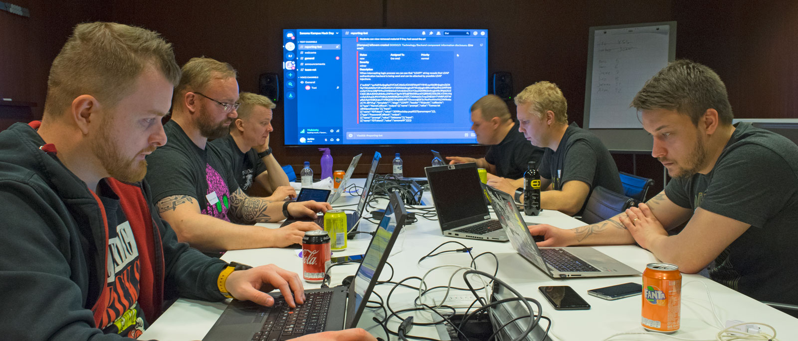

# Who we are

We are Rotco Oy, a team of six hackers from Finland. We are also known as white hat hackers of [Team ROT](https://www.rot.fi) for our non-profit activities. Hacking and learning new things about security is a passion for us, not just a job that pays the bills. We want to have fun, but Rotco Oy is our professional and commercial side.

# Rotco services 

We are mostly interested in technical penetration testing gigs and live hack events. We have wide experience in information security, backed up by deep knowledge about software development, linux and network administration and cloud services, but our main forte is in testing web based software systems.

# Contact information

If you have a proposal or simply need experienced hackers to help you with something, contact us:

General inquiry and sales: info@rotco.fi
Jarmo Puttonen (CEO): jarmo@rotco.fi

# References

Some of our clients have kindly given as a permission to mention them. We are very grateful.

TODO: logot tänne + testimonials jos niitä on.
